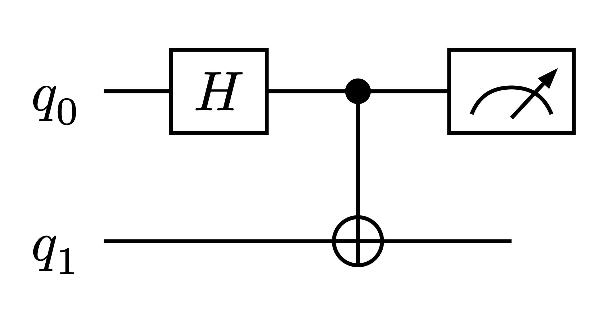
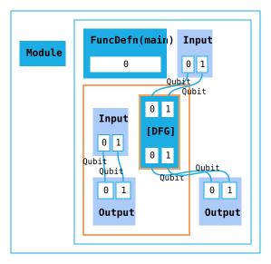
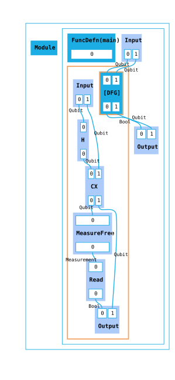
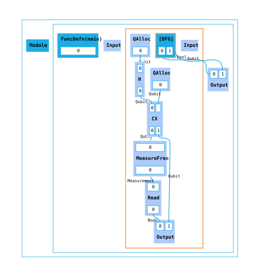
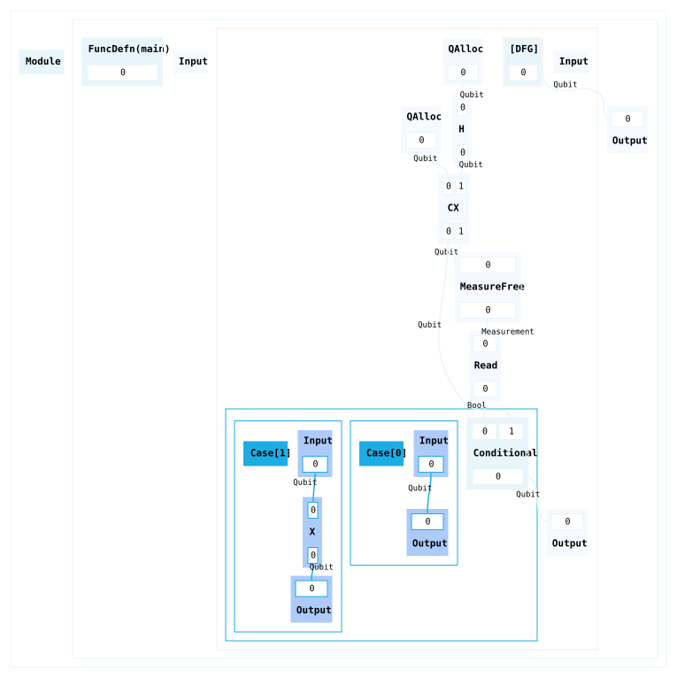
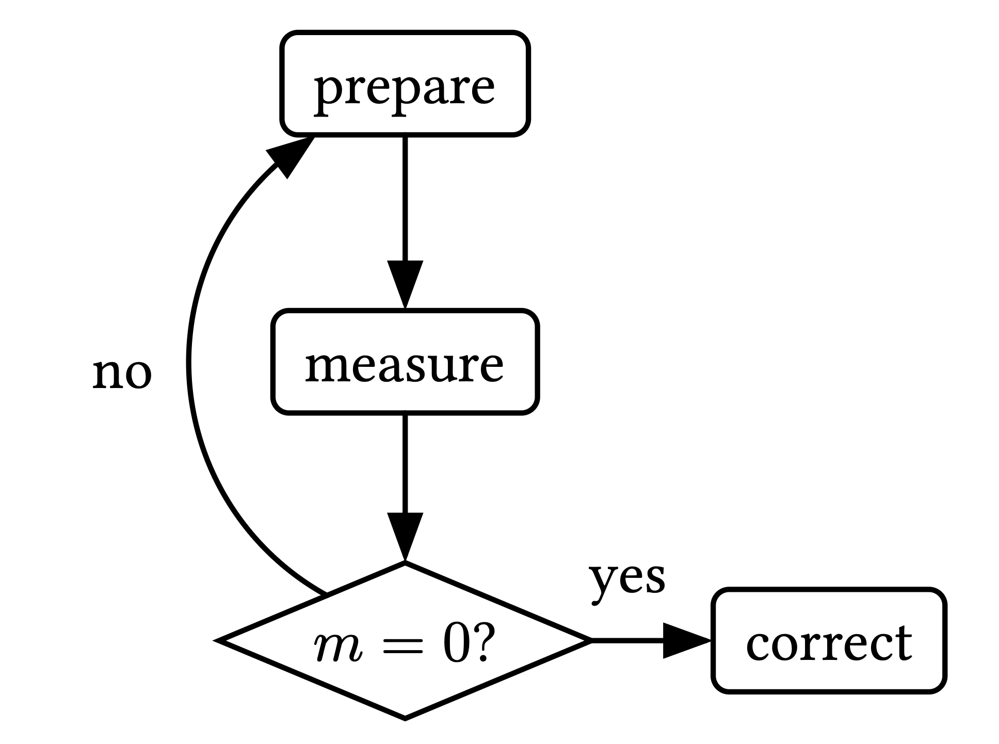
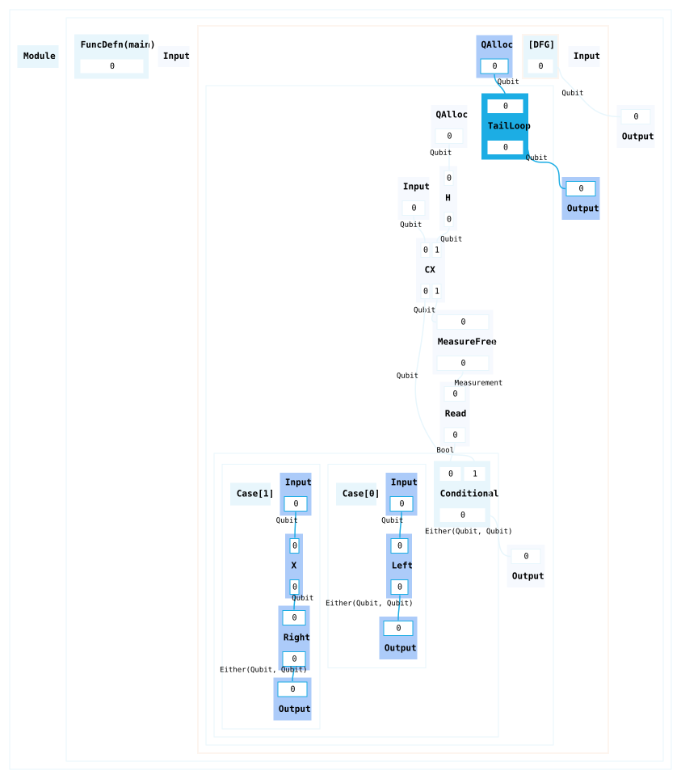
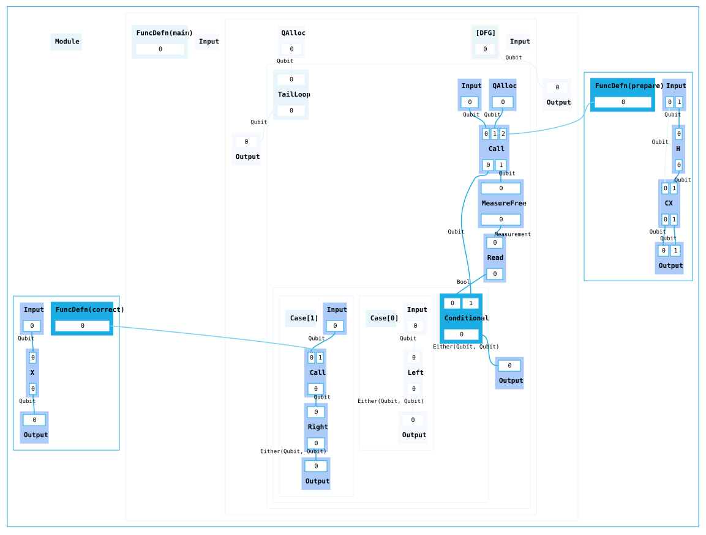

# A Beginner's Guide to Building HUGR Graphs in Python

[TODO: Intro]

## Translating a basic circuit into HUGR

Consider this circuit that constructs a bell pair from two qubits and then measures one of them.



It consists of two basic types of components: the wires representing qubit values flowing through the circuit, and quantum operations that can be applied to the wires, representing an action being performed on one or more qubits.

Now let's look at a simple HUGR graph and compare it to the circuit.

A HUGR graph is essentially just a **dataflow graph** (DFG), meaning a graph where nodes are operations and edges represent values flowing from the output of one operation to the input of another, implicitly encoding which computations depend on which other computations. We'll start by initialising a dataflow graph (`Dfg`) with two qubits.

```py
from hugr import tys
from hugr.build.tracked_dfg import TrackedDfg

circ = TrackedDfg(tys.Qubit, tys.Qubit, track_inputs=True)

circ.set_tracked_outputs()
```

The `Tracked` in `TrackedDfg` means we can refer to any tracked wires in the graph by index (as opposed to passing them around directly as we will see in later examples). Even though we are not doing anything in particular with the qubits yet, we need to define the inputs and outputs of the graph. We define the inputs of the graph by passing their types: in this case `Qubit` is available in the built-in `tys` module. The outputs are set by calling `set_tracked_outputs`, which automatically connects all tracked wires to the output node.

Visualising the HUGR results in the following diagram:



> In Python you can visualise HUGRs by using the `render_dot` method.

While we haven't added any nodes to the graph ourselves yet, we can already notice the similarity between dataflow graph edges of type `Qubit` and wires in a circuit both representing qubit values.

However there are also differences - notably, the HUGR consists of multiple **regions**, with each region container having its own input and output nodes. This is where the **hierarchical** part of "Hierarchical Unified Graph Representation" (HUGR) comes from. Certain nodes can themselves subgraphs as their children. In our graph we can see some of those nodes:
- The `Module` node is a top-level node which as children can only have function definitions, function declarations, or constants.
- Each module needs at least one function definition that acts as an entrypoint to the graph (however for the module to be executable, the function cannot take any inputs). In this case we have a `FuncDefn` node called `main` by default.
- Finally, the function definition contains the `DFG` we created, so far only containing an input and output node. Note how each port on a node is indexed and ordered.

Let's try to further copy the circuit by adding operations representing quantum gates to the graph, using the `add` method. This requires the use of a HUGR **extension**. An extension is a collection of custom types and operations, in this case `tket.quantum` contains common quantum operations.

```py
import tket.extensions as ext

quantum = ext.quantum

circ.add(quantum.H(0))
circ.add(quantum.CX(0, 1))
```

As this is a DFG with tracked wires, we simply refer to each qubit by its index. The `extend` method lets us add multiple operations at the same time. In this case, after adding a measurement operation on the first qubit, we should also add a `read` operation in order to obtain a `Bool`.

```py
circ.extend(quantum.measure_free(0), measure.read(0))
```

 Connecting the outputs as before with `set_tracked_outputs` to finish, we now get the following graph:



**We now have a HUGR representing the circuit at the start of the guide, with nodes corresponding to gates, and wires corresponding to edges!**

Of course a HUGR is more general than a circuit, with nodes and edges being able to represent various classical values and operations too. For this it is important to know that all nodes and edges are **statically typed**, meaning you can only connect edges to ports with matching types according to the signature of a node.

An important concept for types in HUGR is **linearity**: all types in HUGR are either linear or copyable, where linear values are values that need to be used exactly once so they cannot be dropped or copied (whereas copyable values can be). In graph terms this means that edges of linear types go from exactly one outport to exactly one inport (multuple or no connections are not allowed). This is useful for representing the no-clone and no-delete properties of qubits.

We can demonstrate this concept by looking at the outputs of our DFG. As mentioned before, `set_tracked_outputs` connects all wires to the output automatically. If we instead set the outputs manually by index, we need to be careful to not drop any linear values. So if we connected only the first wire using `circ.set_indexed_outputs(0)` and then tried to validate the resulting HUGR, we would get the following error, as `Qubit` is a linear type:

```
hugr._hugr.model.HugrCliError: Error validating HUGR.

Caused by:
    0: Package validation error.
    1: Node(8) has an unconnected port Port(Outgoing, 1) of type qubit.
```

> You can validate HUGRs either using the CLI tool or by calling `hugr.cli.validate` with a package containing the module you want to check.

If we only connected the second wire with `circ.set_indexed_outputs(1)`, the HUGR would be valid as `Bool` is a copyable type that can be dropped.

> For debugging these kind of validation errors visually, it may be be useful to pass a `RenderConfig` with `display_node_id` set to `True` to `render_dot`.

It was mentioned earlier that for this HUGR to be executable, you need the `main` entrypoint to not have any inputs. Let's do this by allocating the qubits instead. This is also useful for demonstrating how to assign and pass around wires directly instead of using indices, which is useful for the remaining examples (it is also how the Guppy compiler generally handles wires).

First initialise the DFG without any inputs:

```py
circ = TrackedDfg()
```

Then use the `qAlloc` operation to get two qubit wires, and optionally register them as being tracked wires if you still want to refer to them by index (as opposed to using the `q0` and `q1` variables).

```py
q0 = circ.add(quantum.qAlloc()).out(0)
q1 = circ.add(quantum.qAlloc()).out(0)
circ.track_wires([q0, q1])
```



You can find the full example code [here](code/example-basic.py).

## Adding control flow to represent dynamic measurements

So far all the data in our graph only followed one specific path. What if we now wanted change the example to do something depending on the outcome of the measurement of the first qubit?

We still start with a `TrackedDfg` with no inputs as before, but then to make it easier to follow what happens with each qubit, let's rename `q0` and `q1` to `data` and `ancilla` and also give the measurement result a name.

```py
data = circ.add(quantum.qAlloc())
ancilla = circ.add(quantum.qAlloc())

ancilla = circ.add(quantum.H(ancilla))
data, ancilla = circ.add(quantum.CX(data, ancilla))

measurement = circ.add(quantum.measure_free(ancilla))
result = circ.add(measure.read(measurement))
```

We then add a `Conditional` node, which creates a new region with subgraphs for each case. We can use `add_if` as a special short hand for a conditional with two cases that branches based on a `Bool` value. In the `True` branch (`result = 1`) we will "correct" the `data` qubit by applying an `X` gate operation, otherwise we just pass the qubit back untouched.

```py
with circ.add_if(result, data) as if_:
    flipped = if_.add(quantum.X(if_.input_node[0]))
    if_.set_outputs(flipped)

with if_.add_else() as else_:
    else_.set_outputs(else_.input_node[0])

circ.set_outputs(if_.conditional_node[0])
```

It is possible to not use context managers and instead assign the results of `add_if` and `add_else` to builder variables (and then it is also possible to convert those builders into tracked versions). However using `with` blocks is a useful way of keeping track of the hierarchy, as each block represents a new subgraph inside a node in the dataflow graph.



[TODO: Finish writing this section]

- Not a realistic scenario, but general building block of preparing and then correcting based on some ancilla measurement
- Another common scenario are repeat-until-success algorithms, where we do not only branch once, but keep iterating until some condition is met

[TODO: Add break and continue to diagram, fix retry condition]



- The way this can be represented in HUGR is TailLoops
- Tail loops branch based on sum types, generalisation of the bool type which is a special unit sum
- In general can tag types, here we use break and continue (alias for left and right)



You can find the full example code [here](code/example-control-flow2.py).

## Generalising through functions and polymorphism

[TODO: Finish writing this section]

- As diagram showed earlier, you might want to generalise this loop, or group together common sequences of gates that can be reused
- We can do this by defining functions on the module in addition to the main function, and then calling them where we previously added operations directly



- We can use this same pattern to now use more complicated useful preparation and correction gadgets defined in those function, with the repeat-until-success loops working in the same manner
- One final feature for this tutorial that might prove useful to do this is polymophism, so the ability to define functions that work for different types or different parameters
- a common data structure utilising bounded nats for example are arrays
- To start with a simple extention to demonstrate this, let's add a `correct_all` function which operates on an array of qubits instead of only one, and use it inside of our loop (even though we only have one qubit)

[TODO: Finish diagram and code for polymorphic example]

You can see the full example code [here](code/example-functions2.py).
