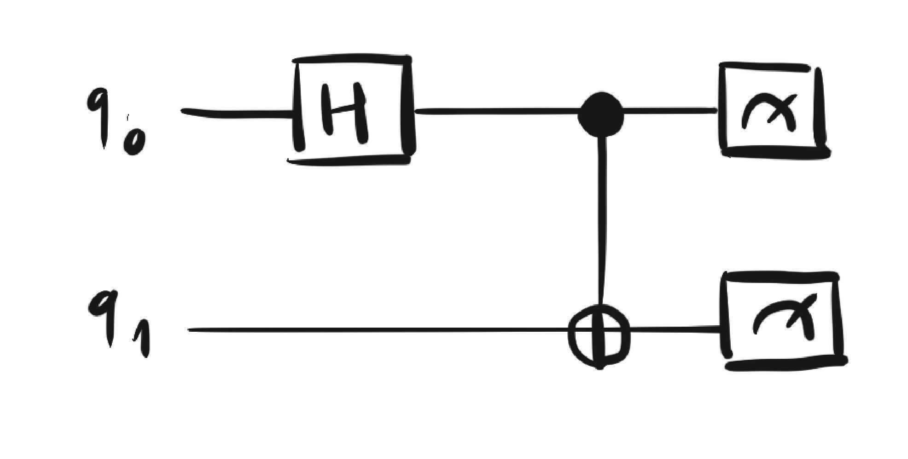
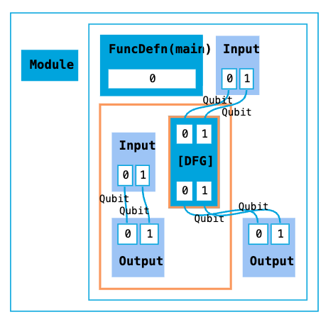
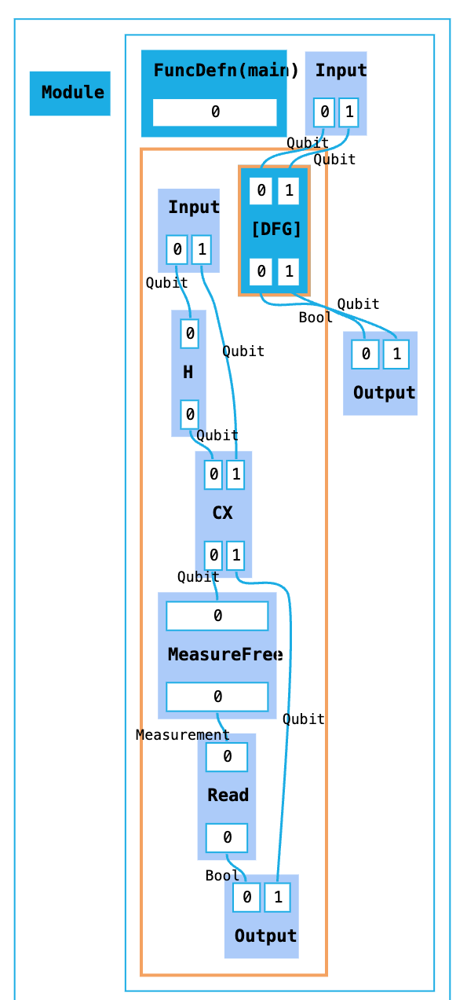
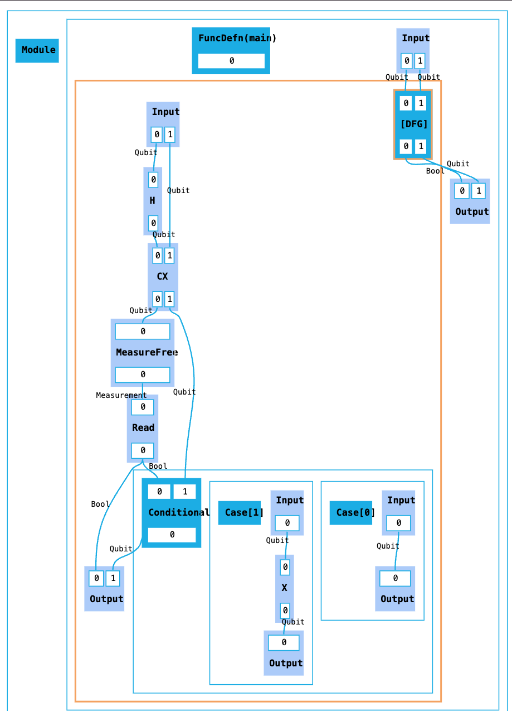
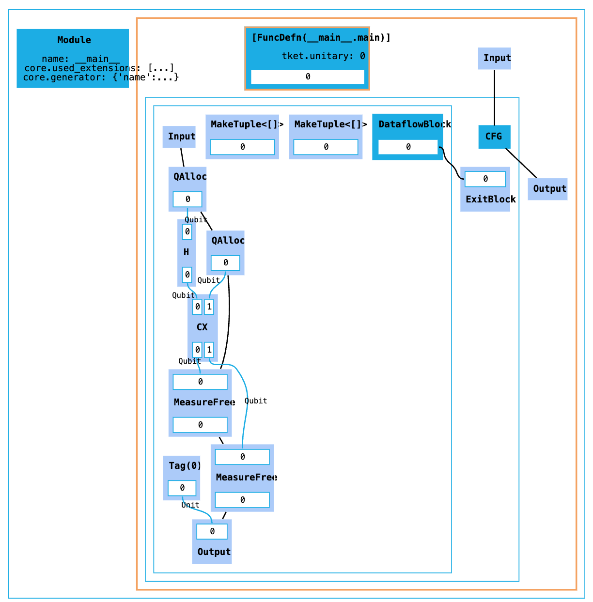
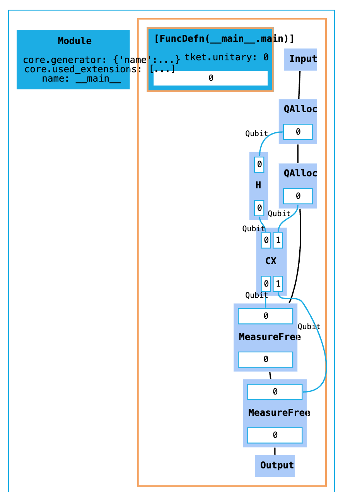

# A Beginner's Guide to Building HUGRs in Python

We will start by building a dataflow graph corresponding to the simple circuit constructing a bell pair below and then progressively add more features to it.



```py
from hugr import tys
from hugr.build.tracked_dfg import TrackedDfg

circ = TrackedDfg(tys.Qubit, tys.Qubit, track_inputs=True)
```

- `TrackedDfg` allows us to work on wires by index instead of passing them around
- `tys` is the built-in module of types, `Qubit` is one of them

> You can visualise HUGRs using `render_dot` in Python.



We haven't added any operations ourselves, but notice in the graph:
- Nodes representing operations, with indexed inports and outports, some of which creating new dataflow regions (creating a hierarchy, hence "hierarchical" graph representation)
- Module node with function definition `main` as entrypoint, though executable module must take no arguments as input
- Input and output nodes in each region container, with edges representing the qubit values

Let's add operations representing quantum gates to the graph. This requires the use of a HUGR extension. An extension is a collection of custom types and operations, in this case `tket.quantum` contains common quantum operations.

```
import tket.extensions as ext

quantum = ext.quantum

circ.add(quantum.H(0))
circ.add(quantum.CX(0, 1))
```

After adding a measurement operation on the first qubit, we should also add a `read` operation in order to obtain a `Bool`. The `extend` method lets us add multiple operations at the same time.

```
circ.extend(quantum.measure_free(0), measure.read(0))
```

Finally we also need to connect the wires to the output node after the gates have been applied.

```
circ.set_tracked_outputs()
```



Note that `set_tracked_outputs` connects all wires to the output automatically. If we instead set the outputs manually by index using we need to be careful to not drop any linear values.
- All types in HUGR are either linear or copyable
- Linear values need to be used exactly once, so they cannot be dropped or copied

If we connected only the second wire using `circ.set_indexed_outputs(1)` and then tried to validate the resulting HUGR, we would get the following error as `Qubit` is a linear type.

```
hugr._hugr.model.HugrCliError: Error validating HUGR.

Caused by:
    0: Package validation error.
    1: Node(8) has an unconnected port Port(Outgoing, 1) of type qubit.
```

> Note you can validate HUGRs either using the CLI or by using `hugr.cli.validate` on a package (note having to load extensions into package).

If we only connected the first wire with `circ.set_indexed_outputs(0)`, the HUGR would be valid as `Bool` is a copyable type that can be dropped.

> Note that if we were using just a `Dfg` you would have to pass the wires in the following manner instead of indexing. This is useful to keep in mind when adding operations in dataflow containers which have no tracked versions (such as the conditionals we will see in the next section). The Guppy compiler generally passes wires directly.

We now have a HUGR representing a bell pair preparation circuit!

## Adding control flow to the graph

What if we now wanted to change the second qubit based on the measurement of the first qubit? First we will get the bool wire directly in order to be able to branch on it.

```py
_, bit = circ.extend(quantum.measure_free(0), measure.read(0))
```

Then we can add a new conditional block, consisting of an if branch followed by an else branch.

```py
with circ.add_if(bit, circ.tracked_wire(1)) as if_:
       if_.set_outputs(if_.add(quantum.X(if_.input_node[0])))

with if_.add_else() as else_:
       else_.set_outputs(else_.input_node[0])
       circ.tracked[1] = else_.conditional_node
```



- `If`/`else` is a special case of conditional nodes with two cases
- Branching happens on sum types, explain sum types (in particular, `tys.Either`)
- Sum types also used for `TailLoops`, explain tail loops
- Example for tail loops: reset qubits through repeat-until-success using `add_tail_loop` / `ops.Continue` / `ops.Break`

## Generalising the graph

- In this section generalise the running example to create a GHZ state using a generic funtion
- `define_function` on an explicit module / `main.call` to call the created function
- Maybe first use `load_constant` to have a specific function and showcase constants, then params

> At this point also have a notebook link to the full examples?

## Exploring a generated graph

Let's now go back to the original bell pair HUGR and compare it to one generated by the Guppy compiler for a program representing the circuit we want to implement.

```py
from guppylang import guppy
from guppylang.std.lang import owned
from guppylang.std.quantum import Measurement, cx, h, measure, qubit


@guppy
def bell_pair(q1: qubit @ owned, q2: qubit @ owned) -> tuple[bool, Measurement]:
    h(q1)
    cx(q1, q2)
    return measure(q1).read(), measure(q2)

@guppy
def main() -> None:
    q1 = qubit()
    q2 = qubit()
    bell_pair(q1, q2)

hugr = main.with_minimal_opt().compile().modules[0]
```

- Note we are using `with_minimal_opt` to get the graph as it is built by the compiler before any optimisations first
- This time instead of immediately looking at the visualisation, we will first try to explore the graph programmatically
- `nodes` / `children`, `descendants` / `in/output_neighbours`, `neighbours` / `in/outcoming_links`, `linked_ports` / `sorted_region_nodes` / `port_type`, `port_kind`
- It will become obvious that there is a `CFG` node which we then can also see in the visualiation, explain why CFGs are used in addition to conditionals (incl. the `Tag` node)



- There are a few other differences to the graph we built with the `TrackedDfg`
- Explain order edges around `QAlloc`/`Measure`
- Explain the metadata added to various nodes
- Explain the `MakeTuple` nodes

If we now compile the Guppy code again this time with default optimisations turned on, we can see that a lot of the differing nodes above are now removed as they weren't necessary in this particular program, and the graph now looks pretty much like the one we constructed earlier in the tutorial.


