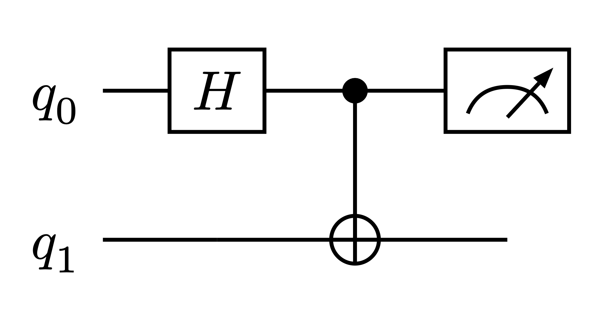
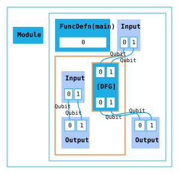
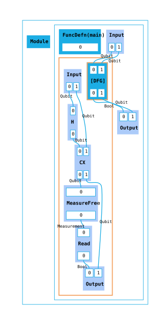
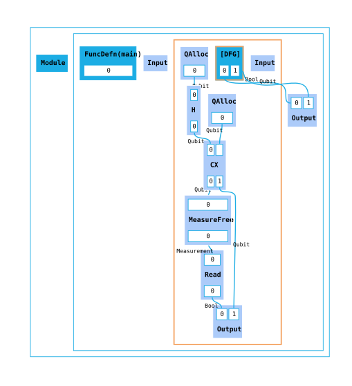
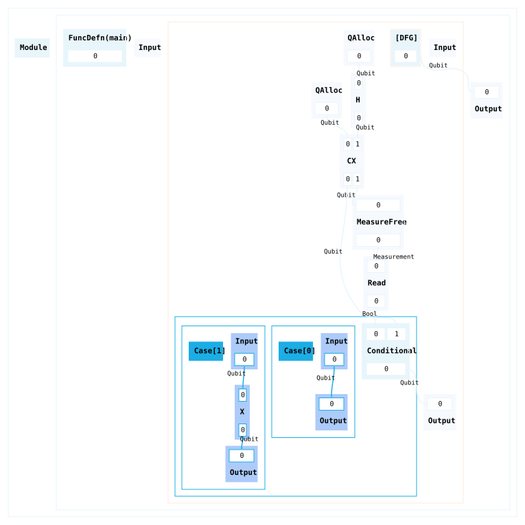
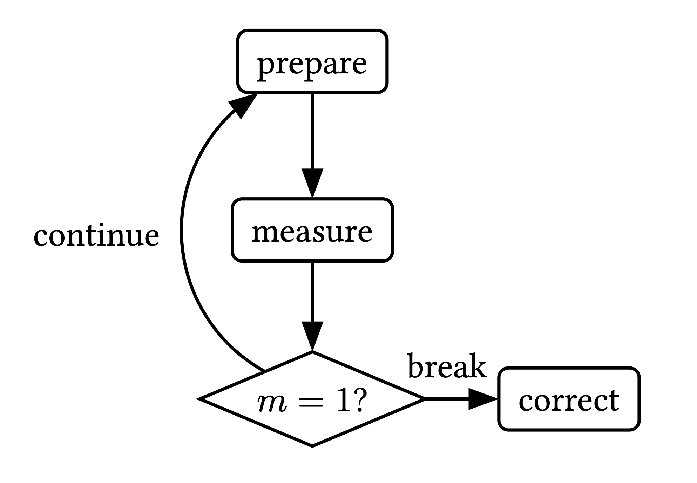
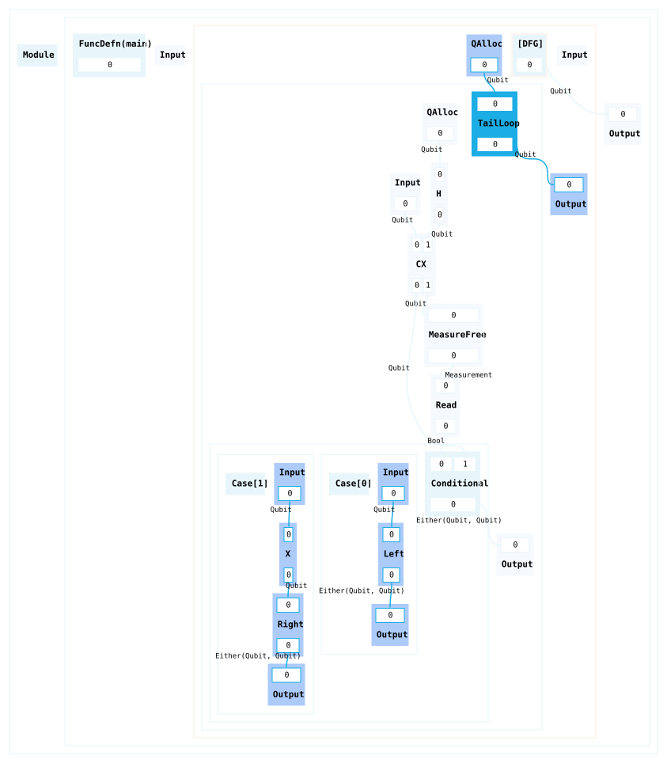
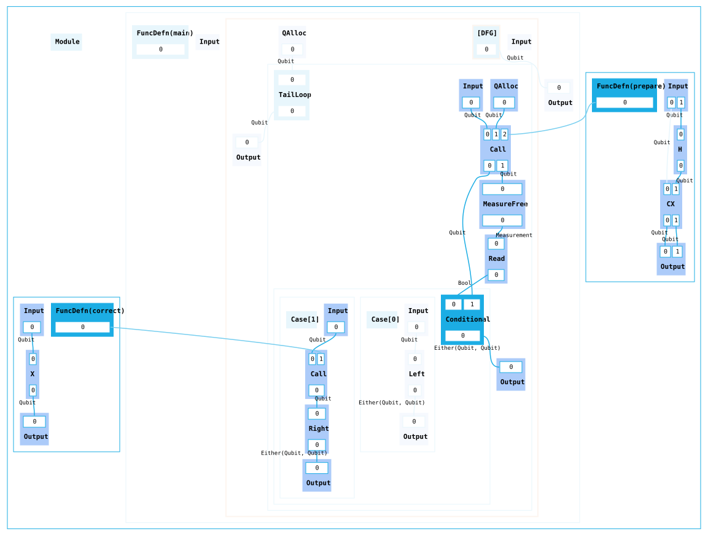
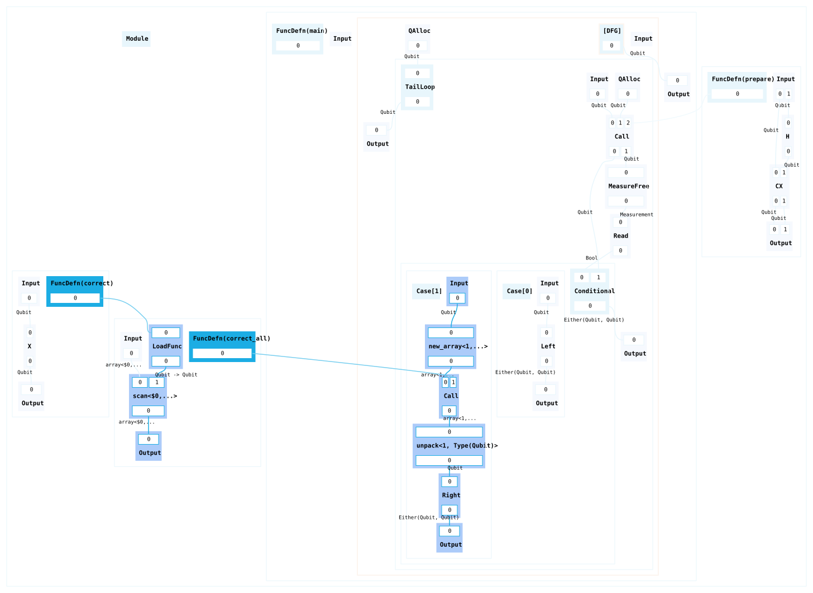

# A beginner's guide to building HUGR graphs in Python

The goal of this guide is to give a practical introduction to constructing HUGR graphs using the Python interface, demonstrating how various HUGR features lend themselves well to representing quantum algorithms.

To follow along with the examples, you will need to install `hugr` and `tket` in your environment:
```
pip install hugr tket
```

## Translating a basic circuit into HUGR

### Creating a dataflow graph

Consider this circuit that constructs a Bell pair from two qubits and then measures one of them.



It consists of two basic types of components: the wires representing qubit values flowing through the circuit, and quantum operations that can be applied to the wires, representing an action being performed on one or more qubits.

Now let's look at a simple HUGR graph and compare it to the circuit.

A typical HUGR graph is just a **dataflow graph** (DFG), meaning a graph where nodes represent operations and edges represent values flowing from the output of one operation to the input of another, implicitly encoding which computations depend on which other computations. We'll start by initializing a dataflow graph with two qubits.

```py
from hugr import tys
from hugr.build.tracked_dfg import TrackedDfg

circ = TrackedDfg(tys.Qubit, tys.Qubit, track_inputs=True)

circ.set_tracked_outputs()
```

A `TrackedDfg` is a DFG in which we can refer to any tracked wires in the graph by index (as opposed to passing them around directly, as we will see in later examples). Even though we are not doing anything in particular with the qubits yet, we need to define the inputs and outputs of the graph. We define the inputs of the graph by passing their types: in this case `Qubit`, which is available in the built-in `tys` module. The outputs are set by calling `set_tracked_outputs`, which automatically connects all tracked wires to the output node.

Visualizing the HUGR results in the following diagram:



> You can visualize HUGRs by using the `render_dot()` method. Calling `circ.render_dot()` will give you a graphviz Digraph which you can input into your preferred graphviz viewer to see the graph.

While we haven't added any nodes to the graph ourselves yet, we can already notice the similarity between dataflow graph edges of type `Qubit` and wires in a circuit representing qubit values.

However there are also differences. Notably, the HUGR consists of multiple **regions**, with each region container having its own input and output nodes. This is why a HUGR is "hierarchical". Certain types of node can contain subgraphs as their children. In our graph we can see some of those nodes:
- The `Module` node is a top-level node whose children can only be function definitions, function declarations, or constants.
- Each module needs at least one function definition that acts as an entrypoint to the graph. (For the module to be executable, the function must take no inputs.) In this case we have a `FuncDefn` node called `main` by default.
- Finally, the function definition contains the `DFG` we created, so far only containing an input and an output node. Note how each port on a node is indexed and ordered.

### Adding quantum gates

Let's try to further copy the circuit by adding operations representing quantum gates to the graph, using the `add` method. This requires the use of a HUGR **extension**. An extension is a collection of custom types and operations. Here we use the `tket.quantum` extension, which contains common quantum operations.

```py
import tket.extensions as ext

quantum = ext.quantum

circ.add(quantum.H(0))
circ.add(quantum.CX(0, 1))
```

As this is a DFG with tracked wires, we simply refer to each qubit by its index. The `extend` method lets us add multiple operations at the same time. In this case, after adding a measurement operation on the first qubit, we should also add a `read` operation in order to obtain a boolean value.

```py
measure = ext.measurement

circ.extend(quantum.measure_free(0), measure.read(0))
```

Connecting the outputs as before with `set_tracked_outputs()` to finish, we now get the following graph:



We now have a HUGR representing the circuit described above, with nodes corresponding to gates, and wires corresponding to edges!

### Making sure your HUGR is valid

Of course a HUGR is more general than a circuit, with nodes and edges able to represent classical values and operations too. All nodes and edges in a HUGR are **statically typed**, meaning that edges can only be connected to ports with matching types according to the signature of a node.

An important concept for types in HUGR is **linearity**. All types in HUGR are either linear or copyable. Linear values are values that need to be used exactly once, so they cannot be dropped or copied. In terms of the graph, this means that output ports of linear types must have exactly one edge connecting them to the input port of another node. The principal example of a linear type is the qubit. Here linearity expresses the no-clone and no-delete properties of qubits.

We can demonstrate this concept by looking at the outputs of our DFG. As mentioned before, `set_tracked_outputs()` connects all wires to the output automatically. If we instead set the outputs manually by index, we need to be careful not to drop any linear values. For example, if we connected only the first wire using `circ.set_indexed_outputs(0)` and then tried to validate the resulting HUGR, we would get an error, as `Qubit` is a linear type:

```
hugr._hugr.model.HugrCliError: Error validating HUGR.

Caused by:
    0: Package validation error.
    1: Node(8) has an unconnected port Port(Outgoing, 1) of type qubit.
```

To validate a HUGR, we first need to package it up in order to serialize it (passing any used extensions; `tket_registry()` is a useful collection of extensions commonly requires in quantum HUGRs). It can then be validated through `cli.validate():`

```py
from hugr import cli
import tket_exts

package = Package(
    modules=[circ.hugr], extensions=list(tket_exts.tket_registry().extensions)
)
cli.validate(package.to_bytes())
```

If we only connected the second wire, with `circ.set_indexed_outputs(1)`, the HUGR would be valid, as `Bool` is a copyable type that can be dropped.

> In order to see node identifiers in the graph visualization (which can help with debugging errors such as the one above) you can pass a `RenderConfig` to `render_dot()`. A `RenderConfig` can take various flags that will configure the renderer: in this case you want to set `display_node_id` to `True`.

It was mentioned earlier that for this HUGR to be executable, the `main` entrypoint must not have any inputs. Let's ensure this by allocating the qubits instead of accepting them as inputs. We will now also assign and pass around some wires directly as variables instead of using indices.

First initialize the DFG without any inputs:

```py
circ = TrackedDfg()
```

Then use the `qAlloc` operation to get two qubit wires, and optionally register them as being tracked wires if you still want to refer to them by index (as opposed to using the `q0` and `q1` variables).

> Note that `add()` returns a `Node`, which in many cases can be used directly as a `Wire`, however using `out()` allows you to be more explicit in case of multiple outports and is sometimes required to satisfy type-checking.

```py
circ = TrackedDfg()
q0 = circ.add(quantum.qAlloc()).out(0)
q1 = circ.add(quantum.qAlloc()).out(0)
circ.track_wires([q0, q1])
```



You can find the full example code [here](code/example-basic.py).

## Adding control flow around dynamic measurements

### Conditionals

So far all the data in our HUGR has followed a fixed path through it. What if we now wanted to do something depending on the outcome of a measurement?

We still start with a `TrackedDfg` with no inputs as before. To make it easier to follow what happens with each qubit, let's rename `q0` and `q1` to `data` and `ancilla`, and also give the measurement result a name.

```py
data = circ.add(quantum.qAlloc()).out(0)
ancilla = circ.add(quantum.qAlloc()).out(0)

ancilla = circ.add(quantum.H(ancilla)).out(0)
data, ancilla = circ.add(quantum.CX(data, ancilla))

measurement = circ.add(quantum.measure_free(ancilla))
result = circ.add(measure.read(measurement))
```

We then add a `Conditional`, which creates a new region with a subgraph for each case. We can use `add_if` as a special shorthand for a conditional with two cases that branches based on a `Bool` value. In the `True` branch we will "correct" the `data` qubit by applying an `X` gate, otherwise we just pass the qubit back untouched.

```py
with circ.add_if(result, data) as if_:
    flipped = if_.add(quantum.X(if_.input_node[0]))
    if_.set_outputs(flipped)

with if_.add_else() as else_:
    else_.set_outputs(else_.input_node[0])

circ.set_outputs(if_.conditional_node[0])
```

Using `with` blocks is a useful way of keeping track of the hierarchy, as each block represents a new subgraph inside a node in the dataflow graph, visualized here as new regions:



### Loops

More complex control flow is present in repeat-until-success algorithms, where we need to prepare a state over and over again until it satisfies a certain condition.



This can be represented in HUGR with a `TailLoop` node.

Tail loops decide whether to keep iterating or exit the loop based on a **sum type** value. Sum types are types whose values belong to exactly one of several variants, with each value consisting of a tag signifying which variant it is, plus whatever data the variant carries. For example, the `Bool` type in HUGR is a sum of two unit variants (with the unit type having only a single value). A more general two-variant sum type is `Either`, with `Left` and `Right` tags which can carry some data. In the example below we will use this type as the condition for our loop, carrying a qubit as data in both cases:

```py
either_ty = tys.Either([tys.Qubit], [tys.Qubit])
```

For this next example we will add a tail loop around a conditional. Inside the loop we will prepare the Bell state as we've done before, and then decide whether to keep iterating or not based on the outcome of the conditional: either the measurement is successful, we correct the qubit and exit the loop, or it isn't and we keep iterating.

We start by adding the tail loop builder. The data qubit is allocated once before we start iterating, while ancilla allocation and state preparation get repeated inside the loop:

```py
from hugr import ops

data = circ.add(quantum.qAlloc())

with circ.add_tail_loop([data], []) as loop:
    [loop_data] = loop.inputs()
    ancilla = loop.add(quantum.qAlloc()).out(0)
    ancilla = loop.add(quantum.H(ancilla)).out(0)
    loop_data, ancilla = loop.add(quantum.CX(loop_data, ancilla))

    measurement = loop.add(quantum.measure_free(ancilla))
    result = loop.add(measure.read(measurement))
```

We now build the same conditional as in the previous example, but instead of simply setting the qubit as its output, we tag it by using `Break` or `Continue` operations (which are convenient ways in the standard library for constructing `Right` and `Left` tags):

```py
# Inside the loop context:
with loop.add_if(result, loop_data) as if_:
    flipped = if_.add(quantum.X(if_.input_node[0]))
    tagged_break = if_.add(ops.Break(either_ty)(flipped))
    if_.set_outputs(tagged_break)

with if_.add_else() as else_:
    tagged_cont = else_.add(ops.Continue(either_ty)(else_.input_node[0]))
    else_.set_outputs(tagged_cont)
```
Finally, set the loop outputs to be the output of the conditional, and the DFG outputs to be the output of the loop and the graph is done!

```py
# Inside the loop context:
loop.set_loop_outputs(if_.conditional_node[0])
```

```py
circ.set_outputs(*loop.outputs())
```



You can find the full example code [here](code/example-control-flow2.py).

## Generalizing through functions and polymorphism

### Functions

You might want to generalize the loop we constructed to work for different `prepare` and `correct` sequences. Or you might want to avoid adding the same gate sequences repeatedly to a graph. The best way to do this is by using **functions**.

Functions can be defined as children of the module node using `define_function()`, alongside the `main` function we have already seen. The method takes a function name and type signature and returns a builder, to which we can add nodes, just as we have done with DFG, conditional, or loop builders.

Let's put the gates we added in the previous example into two functions, `prepare` and `correct`, abstracting them away from the loop logic.

```py
module = circ.module_root_builder()

with module.define_function("prepare", [tys.Qubit, tys.Qubit]) as prepare:
    p_data, p_ancilla = prepare.inputs()
    p_ancilla = prepare.add(quantum.H(p_ancilla)).out(0)
    p_data, p_ancilla = prepare.add(quantum.CX(p_data, p_ancilla))
    prepare.set_outputs(p_data, p_ancilla)

with module.define_function("correct", [tys.Qubit]) as correct:
    (c_data,) = correct.inputs()
    c_data = correct.add(quantum.X(c_data)).out(0)
    correct.set_outputs(c_data)
```

Now they can be used from inside the DFG, through call nodes. Note that we always require the `FuncDefn` node in order to create a `Call`, which is the parent of the function graph builder the `define_function()` method returns.

```py
...
# Inside the loop context:
loop_data, ancilla = loop.call(prepare.parent_node, loop_data, ancilla)
...
# Inside the if branch context:
flipped = if_.call(correct.parent_node, if_.input_node[0])
...
```



We can use this same pattern to define more complicated and useful preparation and correction gadgets in those functions.

### Polymorphism

One final HUGR feature we will look at in this introduction is **polymorphism**: the ability to define functions that work for different types or parameters.

To demonstrate this, let's add a `correct_all` function which operates on an array of qubits instead of only one qubit, and applies an `X` gate to all of them.

For this we will need the array extension, which can be found as part of the standard collections libraries in HUGR:

```py
from hugr.std.collections.array import EXTENSION as ARRAY_EXTENSION
from hugr.std.collections.array import Array
```

In contrast to the TKET extensions we have used so far, the array extension does not provide a Python interface that allows us to use its operations directly (it does have a Python wrapper for the type, `Array`). Instead we have to retrieve any operations we require by name. As the array type is generic in type and length, we also need to instantiate each of its generic operation definitions with type arguments. For this it is useful to create wrapper functions which take a type and integer and return a concrete array operation.

The `new_array` operation allows us to create a new array. After getting the operation definition through `get_op()`, we instantiate it by passing arguments for each type parameter and a concrete function type signature to `instantiate()`. Note how we pass a `BoundedNatArg` to represent the length of this array and a `TypeTypeArg` to represent the element type:

```py
def new_array_op(elem_ty: tys.Type, length: int) -> ops.ExtOp:
    length_arg = tys.BoundedNatArg(length)
    elem_arg = tys.TypeTypeArg(elem_ty)
    arr_ty = Array(elem_ty, length)
    return ARRAY_EXTENSION.get_op("new_array").instantiate(
        [length_arg, elem_arg], tys.FunctionType([elem_ty] * length, [arr_ty])
    )
```

The `scan` operation allows us to map a function over the whole array. This means we need to pass arguments for both the initial element type and the new element type after the function has been applied (there is also the option to accumulate values, however we will leave the accumulator argument empty in this example). We allow both an integer or a `TypeArg` for the length in this case for convenience:

```py
def array_scan_op(
    elem_ty: tys.Type, new_elem_ty: tys.Type, length: int | tys.TypeArg
) -> ops.ExtOp:
    length_arg = tys.BoundedNatArg(length) if isinstance(length, int) else length
    ty_args = [
        length_arg,
        tys.TypeTypeArg(elem_ty),
        tys.TypeTypeArg(new_elem_ty),
        tys.ListArg([]),
    ]
    ins: list[tys.Type] = [Array(elem_ty, length_arg), tys.FunctionType([elem_ty], [new_elem_ty])]
    outs: list[tys.Type] = [Array(new_elem_ty, length_arg)]
    return ARRAY_EXTENSION.get_op("scan").instantiate(
        ty_args, tys.FunctionType(ins, outs)
    )
```

The final operation we will require is `unpack`, which splits an array back into its individual elements. This also consumes the array, which is something we have to keep in mind as arrays in HUGR are linear regardless of element type:

```py
def array_unpack_op(elem_ty: tys.Type, length: int) -> ops.ExtOp:
    length_arg = tys.BoundedNatArg(length)
    elem_arg = tys.TypeTypeArg(elem_ty)
    arr_ty = Array(elem_ty, length)
    return ARRAY_EXTENSION.get_op("unpack").instantiate(
        [length_arg, elem_arg], tys.FunctionType([arr_ty], [elem_ty] * length)
    )
```

We now define another function on the module, `correct_all`. It not only takes a name and input types, but also requires a parameter, making it polymorphic. We can utilize this parameter in the type signature by creating a type variable `VariableArg` that refers to the parameter with de Bruijn indices (since we only have one in this case, this is just 0 here). Inside of the function block we load the `correct` function and apply it to all the elements of the input array using `array_scan_op`:

```py
n_param = tys.BoundedNatParam()

with module.define_function(
    "correct_all",
    [Array(tys.Qubit, tys.VariableArg(0, n_param))],
    type_params=[n_param],
) as correct_all:
    (qs,) = correct_all.inputs()
    correct_fn = correct_all.load_function(correct.parent_node)
    qs = correct_all.add_op(
        array_scan_op(tys.Qubit, tys.Qubit, tys.VariableArg(0, n_param)), qs, correct_fn
    ).out(0)
    correct_all.set_outputs(qs)
```

To finish this example, we now just need to replace the `if` branch of the conditional. We create a new array of length `1` containing the qubit we intend to correct, pass this array to the `correct_all` function and then unpack the resulting array to get a single qubit again. As `correct_all` is polymorphic, we need to pass a concrete function signature and the type argument instantiating the parameter in the signature to the `call` operation:

```py
one_qubit_arr_ty = Array(tys.Qubit, 1)

arr = if_.add_op(new_array_op(tys.Qubit, 1), if_.input_node[0])
arr = if_.call(
    correct_all.parent_node,
    arr,
    instantiation=tys.FunctionType([one_qubit_arr_ty], [one_qubit_arr_ty]),
    type_args=[tys.BoundedNatArg(1)],
)
(flipped,) = if_.add_op(array_unpack_op(tys.Qubit, 1), arr)

tagged_break = if_.add(ops.Break(either_ty)(flipped))
if_.set_outputs(tagged_break)
```



You can see the full example code [here](code/example-functions2.py).
