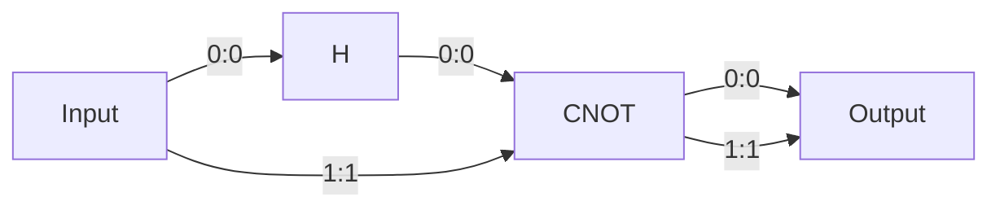
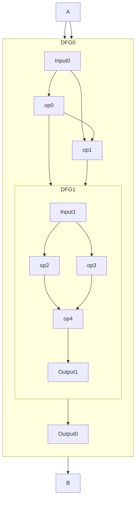
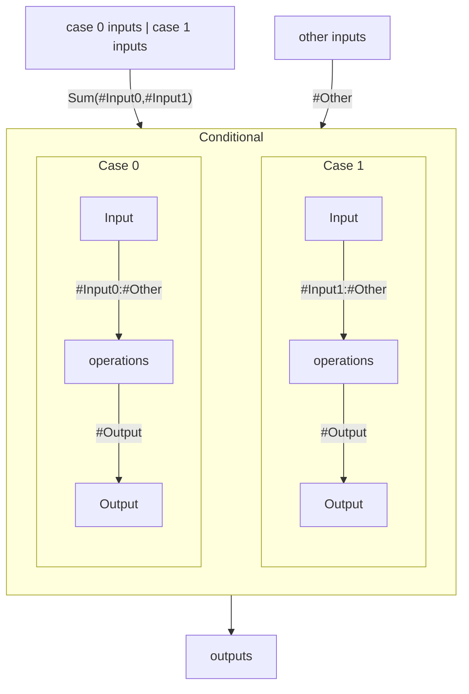
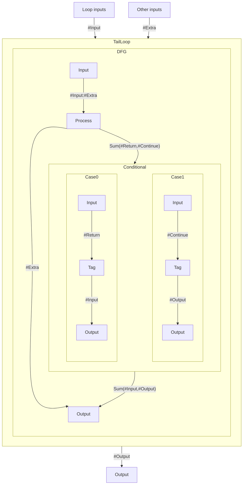
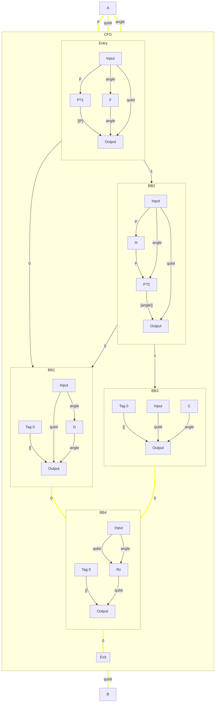
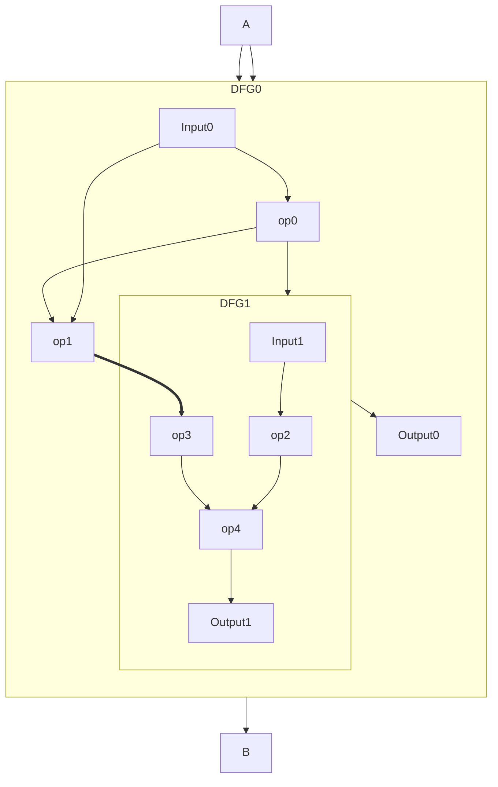
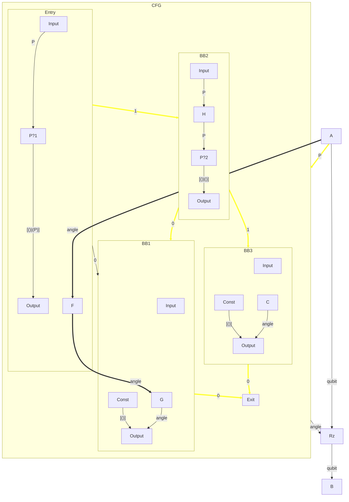

# HUGR: Structure and Semantics

A HUGR is a directed graph. There are several different types of node, and
several different types of edge, with different semantics, described below.

A node usually has additional data associated with it, which we will
refer to as its *node weight*.

The nodes represent
processes that produce values - either statically, i.e. at compile time,
or at runtime. Each node is uniquely identified by its **node index**,
although this may not be stable under graph structure modifications.
Each node is defined by its **operation**; the possible operations are
outlined in [Node Operations](#node-operations)
but may be [extended by Extensions](#extension-system).

## Simple HUGR example



In the example above, a 2-qubit circuit is described as a dataflow
region of a HUGR with one `H` operation and one `CNOT` operation. The
operations have an incoming and outgoing list of ports, with each
element identified by its offset and labelled with a type.
In the diagram the edge label includes the source and target port indices as `<source>:<target>`.

The signature of the `CNOT` operation is `[Qubit, Qubit] → [Qubit,
Qubit]`. Further information in the metadata may label the first qubit
as *control* and the second as *target*.

In this case, output 0 of the H operation is connected to input 0 of the
CNOT.

## Edges, ports and signatures

The edges of a HUGR encode relationships between nodes; there are several *kinds*
of edge for different relationships. Edges of a given kind are specified to
carry an edge weight:

- `Order` edges are plain directed edges, and express requirements on the
  ordering. They have no edge weight.
- `Value` edges carry typed data at runtime. They have a *port* at each end, associated
  with the source and target nodes. They have an `AnyType`as an edge weight.
- `Const` edges are similar to `Value` edges but carry static data (knowable at
  compilation time). These have as edge weight a `CopyableType`.
- `Function` edges refer to a statically-known function, but with a type scheme
  that (unlike values) may be polymorphic---see [Polymorphism](#polymorphism).
- `ControlFlow` edges represent possible flows of control from one part of the
  program to another. They have no edge weight.
- `Hierarchy` edges express the relationship between container nodes and their
  children. They have no edge weight.

It is useful to introduce some terms for broader classes of edge:
* *Static* edges are the union of the `Const` and `Function` edges
* *Dataflow* edges are the union of `Value` and Static (thus, `Value`, `Const` and `Function`)

A `Value` edge can carry data of any `AnyType`: these include the `CopyableType`s
(which can be freely copied or discarded - i.e. ordinary classical data)
as well as anything which cannot - e.g. quantum data.
A `Const` edge can only carry a `CopyableType`. For
more details see the [Type System](#type-system) section.

As well as the type, Dataflow edges are also parametrized by a
`Locality`, which declares whether the edge crosses levels in the hierarchy. See
[Edge Locality](#edge-locality) for details.

```haskell
AnyType ⊃ CopyableType

EdgeKind ::= Value(Locality, AnyType)
             | Const(Local | Ext, CopyableType) | Function(Local | Ext, PolyFuncType)
             | Hierarchy | Order | ControlFlow
```

Note that a port is associated with a node and zero or more Dataflow or `ControlFlow` edges.
Incoming ports are associated with exactly one Dataflow edge, or any number of
`ControlFlow` edges. Outgoing ports are associated with any number of Dataflow
edges, or exactly one `ControlFlow` edge.
All Dataflow edges associated with a port have the same type; thus a port has a
well defined type, matching that of its adjoining edges. The incoming and
outgoing ports of a node are each ordered independently, meaning that the first
output port will be "0" regardless of how many input ports there are.

The sequences of incoming and outgoing port types (carried on `Value` edges) of a node constitute its
*signature*.

Note that the locality is not fixed or even specified by the signature.

A source port with a `CopyableType` may have any number of edges associated with
it (including zero, which means "discard"). A target port for a `ControlFlow`
edge may also have any number of `ControlFlow` edges associated with it. Any other port
must have exactly one edge associated with it. This captures the property of
linear types that the value is used exactly once.

The `Hierarchy` and `ControlFlow` edges from a node
are ordered (the children of a container node have a linear ordering, as do the
successors of a `BasicBlock` node).

### `Hierarchy` edges

A `Hierarchy` edge from node *a* to *b* encodes that *a* is the direct parent
of *b*. Only certain nodes, known as *container* nodes, may act as parents -
these are listed in
[hierarchical node relationships](#hierarchical-relationships-and-constraints).
In a valid HUGR the hierarchy edges form a tree joining all nodes of the HUGR,
with a unique root node. The HUGR is characterized by the type of its root node.
The root node has no non-hierarchy edges (and this supersedes any other requirements on the
edges of specific node types).

A *sibling graph* is a subgraph of the HUGR containing all nodes with
a particular parent, plus any edges between them.

### `Value` edges

A `Value` edge represents dataflow that happens at runtime - i.e. the
source of the edge will, at runtime, produce a value that is consumed by
the edge's target. Value edges are from an outgoing port of the
source node, to an incoming port of the target node.

### Static edges (`Const` and `Function`)

A Static edge represents dataflow that is statically knowable - i.e.  the source
is a compile-time constant defined in the program. Hence, the types on these
edges are classical. Only a few nodes may be sources (`FuncDefn`, `FuncDecl` and
`Const`) and targets (`Call`, `LoadConstant`, and `LoadFunction`) of these
edges; see [operations](#node-operations).

### `Order` edges

`Order` edges represent explicit constraints on ordering between nodes
(e.g. useful for stateful operations). These can be seen as
local value edges of unit type `()`, i.e. that pass no data, and where
the source and target nodes must have the same parent. There can be at
most one `Order` edge between any two nodes.

### `ControlFlow` edges

`ControlFlow` edges represent all possible flows of control
from one region (basic block) of the program to another. These are
always local, i.e. source and target have the same parent.

## Node Operations

Here we define some core types of operation required to represent
full programs, including [dataflow operations](#dataflow).

### Module

If the HUGR contains a `Module` node then it is unique and sits at the top level
of the hierarchy. In this case we call it a **module HUGR**. The weight
attached to this node contains module level data. There may also be additional
metadata (e.g. source file). The children of a `Module` correspond
to "module level" operation types. Neither `Module` nor these module-level
operations have value ports, but some have Static or other
edges. The following operations are *only* valid as immediate children of a
`Module` node.

- `FuncDecl`: an external function declaration. The name of the function,
  a list of type parameters (TypeParams, see [Type System](#type-system))
  and function attributes (relevant for compilation)
  define the node weight. The node has an outgoing `Function`
  edge for each use of the function. The function name is used at link time to
  look up definitions in linked
  modules (other hugr instances specified to the linker).
- `AliasDecl`: an external type alias declaration. At link time this can be
  replaced with the definition. An alias declared with `AliasDecl` is equivalent to a
  named opaque type.
- `FuncDefn` : a function definition. Like `FuncDecl` but with a function body.
  The function body is defined by the sibling graph formed by its children.
  At link time `FuncDecl` nodes are replaced by `FuncDefn`.
- `AliasDefn`: type alias definition. At link time `AliasDecl` can be replaced with
  `AliasDefn`.

There may also be other [scoped definitions](#scoped-definitions).

### Scoped Definitions

The following operations are valid at the module level as well as in dataflow
regions and control-flow regions:

- `Const<T>` : a static constant value of type T stored in the node
  weight. Like `FuncDecl` and `FuncDefn` this has one `Const<T>` out-edge per use.

A **loadable HUGR** is a module HUGR where all input ports are connected and there are
no `FuncDecl/AliasDecl` nodes.

An **executable HUGR** or **executable module** is a loadable HUGR where the
root Module node has a `FuncDefn` child with function name
"main", that is the designated entry point. Modules that act as libraries need
not be executable.

### Dataflow

Within dataflow regions, which include function definitions,
the following basic dataflow operations are available (in addition to the
[scoped definitions](#scoped-definitions)):

- `Input/Output`: input/output nodes, the outputs of `Input` node are
  the inputs to the function, and the inputs to `Output` are the
  outputs of the function.
- `Call`: Call a statically defined function. There is an incoming
  `Function` edge to specify the graph being called. The `Call`
  node specifies any type arguments to the function in the node weight,
  and the signature of the node (defined by its incoming and outgoing `Value` edges)
  matches the (type-instantiated) function being called.
- `LoadConstant<T>`: has an incoming `Const<T>` edge, where `T` is a `CopyableType`, and a
  `Value<T>` output, used to load a static constant into the local
  dataflow graph.
- `LoadFunction`: has an incoming `Function` edge and a `Value<FunctionType>`
  output. The `LoadFunction` node specifies any type arguments to the function
  in the node weight, and the `FunctionType` in the output edge matches the
  (type-instantiated) function in the incoming `Function` edge.
- `identity<T>`: pass-through, no operation is performed.
- `DFG`: A nested dataflow graph.
  These nodes are parents in the hierarchy.
  The signature of the operation comprises the output signature of the child
  Input node (as input) and the input signature of the child Output node (as
  output).
- `ExtensionOp`: an operation defined by an [Extension](#extension-system).

The example below shows two DFGs, one nested within the other. Each has an Input
and an Output node, whose outputs and inputs respectively match the inputs and
outputs of the containing DFG.



### Control Flow

In a dataflow graph, the evaluation semantics are simple: all nodes in
the graph are necessarily evaluated, in some order (perhaps parallel)
respecting the Dataflow edges. The following operations are used to
express control flow, i.e. conditional or repeated evaluation.

#### `Conditional` nodes

These are parents to multiple `Case` nodes; the children have no edges.
The first input to the Conditional-node is of Sum type (see below), whose
arity matches the number of children of the Conditional node. At runtime
the sum's tag is inspected to select which child to execute; the elements of
the tagged row of the Sum, with all remaining inputs to Conditional
appended, are sent to this child, and all outputs of the child are the
outputs of the Conditional; that child is evaluated, but the others are
not. That is, Conditional-nodes act as "if-then-else" followed by a
control-flow merge.




#### `TailLoop` nodes

These provide tail-controlled loops. The dataflow sibling graph within the
TailLoop-node defines the loop body: this computes a row of outputs, whose
first element has type `Sum(#Input, #Output)` and the remainder is a row `#Extra`
(perhaps empty). Inputs to the contained graph and to the TailLoop node itself
are the row `#Input:#Extra`, where `:` indicates row concatenation (with the row
inside the `Sum`).

Evaluation of the node begins by feeding the node inputs into the child graph
and evaluating it.  The `Sum` produced by the child graph controls iteration of
the loop:

- The first variant (`#Input`) means that these values, along with the other
 sibling-graph outputs `#Extra`, are fed back into the top of the loop,
 and the body is evaluated again (thus perhaps many times)
- The second variant (`#Output`) means that evaluation of the `TailLoop` node
 terminates, returning all the values produced as a row of outputs
 `#Output:#Extra`.



#### Control Flow Graphs

When Conditional and `TailLoop` are not sufficient, the HUGR allows
arbitrarily-complex (even irreducible) control flow via an explicit `CFG` node:
a dataflow node defined by a child control sibling graph. This sibling
graph contains `BasicBlock` nodes (and [scoped definitions](#scoped-definitions)),
with the `BasicBock` nodes connected by `ControlFlow` edges (not dataflow).
`BasicBlock`-nodes only exist as children of `CFG`-nodes.

There are two kinds of `BasicBlock`: `DFB` (dataflow block) and `Exit`.
Each `DFB` node is parent to a dataflow sibling graph. `Exit` blocks
have only incoming control-flow edges, and no children.

The first child of the `CFG` is the entry block and must be a `DFB`,
with inputs the same as the CFG-node; the second child is an
`Exit` node, whose inputs match the outputs of the CFG-node.
The remaining children are either `DFB`s or [scoped definitions](#scoped-definitions).

The first output of the graph contained in a `DFB` has type
`Sum(#t(0),...,#t(n-1))`, where the node has `n` successors, and the
remaining outputs are a row `#x`. `#t(i)` with `#x` appended matches the
inputs of successor `i`.

Some normalizations are possible:

- If the entry node has no predecessors (i.e. is not a loop header),
  then its contents can be moved outside the CFG node into a containing
  graph.
- If the entry node has only one successor and that successor is the
  exit node, the CFG node itself can be removed.

The CFG in the example below takes three inputs:

- A value `v` of type "P" (its exact structure isn’t specified, but it can be converted to a boolean—this conversion is represented by the nodes labeled "P?1" and "P?2").
- A value of type "qubit".
- A value `t` of type "angle".

The CFG applies an `Rz` rotation to the qubit. The rotation angle `x` is determined as follows:

- If both `v` and `H(v)` evaluate to true, then `x` is the constant `C`.
- Otherwise, `x` is `G(F(t))`.

Here, `H` maps values of type "P" to "P", and both `F` and `G` map values of type "angle" to "angle".


The `DFB` nodes are labelled `Entry` and `BB1` to `BB4`. Note that the first
output of each of these is a sum type, whose arity is the number of outgoing
control edges; the remaining outputs are those that are passed to all
succeeding nodes.

The three nodes labelled "Tag 0" are simply generating a 1-variant unary Sum (i.e. a Sum of one variant with empty rows) to the Output node.



### Hierarchical Relationships and Constraints

To clarify the possible hierarchical relationships, using the operation
definitions above and also defining "*O"* to be all non-nested dataflow
operations, we can define the relationships in the following table.
**D** and **C** are useful (and intersecting) groupings of operations:
dataflow nodes and the nodes which contain them. The "Parent" column in the
table applies unless the node in question is a root node of the HUGR (when it
has no parent).

| **Hierarchy**             | **Edge kind**                  | **Node Operation** | **Parent**    | **Children (\>=1)**      | **Child Constraints**                    |
| ------------------------- | ------------------------------ | ------------------ | ------------- | ------------------------ | ---------------------------------------- |
| Leaf                      | **D:** Value (Data dependency) | O, `Input/Output`  | **C**         | \-                       |                                          |
| CFG container             | **D**                          | CFG                | **C**         | `BasicBlock`             | First(second) is entry(exit)             |
| Conditional               | **D**                          | `Conditional`      | **C**         | `Case`                   | No edges                                 |
| **C:** Dataflow container | **D**                          | `TailLoop`         | **C**         |  **D**                   | First(second) is `Input`(`Output`)       |
| **C**                     | **D**                          | `DFG`              | **C**         |  **D**                   | First(second) is `Input`(`Output`)       |
| **C**                     | `Function`                     | `FuncDefn`         | **C**         |  **D**                   | First(second) is `Input`(`Output`)       |
| **C**                     | `ControlFlow`                  | `DFB`              | CFG           |  **D**                   | First(second) is `Input`(`Output`)       |
| **C**                     | \-                             | `Case`             | `Conditional` |  **D**                   | First(second) is `Input`(`Output`)       |
| Root                      | \-                             | `Module`           | none          |  **D**                   | Contains main `FuncDefn` for executable HUGR. |

These relationships allow to define two common varieties of sibling
graph:

**Control Flow Sibling Graph (CSG)**: where all nodes are
`BasicBlock`-nodes, and all edges are control-flow edges, which may have
cycles. The common parent is a CFG-node.

**Dataflow Sibling Graph (DSG)**: nodes are operations, `CFG`,
`Conditional`, `TailLoop` and `DFG` nodes; edges are `Value`, `Order` and `Static`, and must be acyclic.
(Thus a valid ordering of operations can be achieved by topologically sorting the
nodes.)
There is a unique Input node and Output node.
The common parent may be a `FuncDefn`, `TailLoop`, `DFG`, `Case` or `DFB` node.

| **Edge Kind**  | **Locality** |
| -------------- | ------------ |
| Hierarchy      | Defines hierarchy; each node has \<=1 parent                                                                                                                                                            |
| Order, Control | Local (Source + target have same parent) |
| Value          | Local, Ext or Dom - see [Edge Locality](#edge-locality) |
| Static         | Local or Ext - see [Edge Locality](#edge-locality) |

## Edge Locality

There are three possible `CopyableType` edge localities:

- `Local`: Source and target nodes must have the same parent.
- `Ext`: Edges "in" from a dataflow ancestor.
- `Dom`: Edges from a dominating basic block in a control-flow graph.

We allow non-local Dataflow edges
n<sub>1</sub>→n<sub>2</sub> where parent(n<sub>1</sub>) \!=
parent(n<sub>2</sub>) when the edge's locality is:

- for Value edges, Ext or Dom;
- for Static edges, Ext.

Each of these localities have additional constraints as follows:

1. For Ext edges, we require parent(n<sub>1</sub>) ==
   parent<sup>i</sup>(n<sub>2</sub>) for some i\>1, *and* for Value edges only there must be a order edge from n<sub>1</sub> to
   parent<sup>i-1</sup>(n<sub>2</sub>).

   The order edge records the
   ordering requirement that results, i.e. it must be possible to
   execute the entire n<sub>1</sub> node before executing
   parent<sup>i-1</sup>(n<sub>2</sub>). (Further recall that
   order+value edges together must be acyclic). We record the
   relationship between the Value edge and the
   corresponding order edge via metadata on each edge.

   For Static edges this order edge is not required since the source is
   guaranteed to causally precede the target.

2. For Dom edges, we must have that parent<sup>2</sup>(n<sub>1</sub>)
   == parent<sup>i</sup>(n<sub>2</sub>) is a CFG-node, for some i\>1,
   **and** parent(n<sub>1</sub>) strictly dominates
   parent<sup>i-1</sup>(n<sub>2</sub>) in the CFG (strictly as in
   parent(n<sub>1</sub>) \!= parent<sup>i-1</sup>(n<sub>2</sub>). (The
   i\>1 allows the node to target an arbitrarily-deep descendant of the
   dominated block, similar to an Ext edge.)

Specifically, these rules allow for edges where in a given execution of
the HUGR the source of the edge executes once, but the target may
execute \>=0 times.

The diagram below is equivalent to the diagram in the [Dataflow](#dataflow)
section above, but the input edge to "op3" has been replaced with a non-local
edge from the surrounding DFG (the thick arrow).



This mechanism allows for some values to be passed into a block
bypassing the input/output nodes, and we expect this form to make
rewrites easier to spot. The constraints on input/output node signatures
remain as before.

HUGRs with only local Dataflow edges may still be useful for e.g. register
allocation, as that representation makes storage explicit. For example,
when a true/false subgraph of a Conditional-node wants a value from the
outside, we add an outgoing port to the Input node of each subgraph, a
corresponding incoming port to the Conditional-node, and discard nodes to each
subgraph that doesn't use the value. It is straightforward to turn an
edge between graphs into a combination of intra-graph edges and extra
input/output ports+nodes in such a way, but this is akin to
decompression.

Conversion from only local edges to a smallest total number of edges
(using non-local edges to reduce their number) is much more complex,
akin to compression, as it requires elision of useless split-merge
diamonds and other patterns and will likely require computation of
(post/)dominator trees. (However this will be somewhat similar to the
analysis required to move computations out of a CFG-node into
Conditional- and TailLoop-nodes). Note that such conversion could be
done for only a subpart of the HUGR at a time.

The following CFG is equivalent to the example given in the
[Control Flow Graphs](#control-flow-graphs) section. In this diagram:

- the thick arrow from "angle source" to "F" is an `Ext` edge (from an
  ancestral DFG into the CFG's entry block);
- the thick arrow from "F" to "G" is a `Dom` edge (from a dominating basic
  block);
- the `Rz` operation has been moved outside the CFG into the surrounding DFG, so
  the qubit does not need to be passed in to the CFG.

As a further normalization it would be possible to move F out of the CFG.
Alternatively, as an optimization it could be moved into the BB1 block.

Indeed every time a SESE region
is found within a CFG (where block *a* dominates *b*, *b* postdominates
*a*, and every loop containing either *a* or *b* contains both), it can
be normalized by moving the region bracketted by *a…b* into its own
CFG-node.



## Exception Handling

### Panic

- Any operation may panic, e.g. integer divide when denominator is
  zero.
- Panicking aborts the current graph, and recursively the container
  node also panics, etc.
- Nodes that are independent of the panicking node may have executed
  or not, at the discretion of the runtime/compiler.
- If there are multiple nodes that may panic where neither has
  dependencies on the other (including Order edges), it is at the
  discretion of the compiler as to which one panics first.

## Extensible metadata

Each node in the HUGR may have arbitrary metadata attached to it. This
is preserved during graph modifications, and,
[when possible](#metadata-updates-on-replacement), copied when rewriting.

For each node, the metadata is a dictionary keyed by strings. Keys are
used to identify applications or users so these do not (accidentally)
interfere with each other's metadata; we use a reverse-DNS system
(`com.quantinuum.tket....`). The values
are required to be serializable.

There is an API to add metadata, or extend existing metadata, or read
existing metadata, given the node ID.
<!---
**TODO** Do we want to reserve any top-level metadata keys, e.g. `Name`,
`Ports` (for port metadata) or `History` (for use by the rewrite
engine)?
-->
Reserved metadata keys used by the HUGR tooling are prefixed with `core.`.
Use of this prefix by external tooling may cause issues.
Keys used by the reference implementation are described in the separate [Metadata](https://github.com/quantinuum/hugr/blob/main/specification/metadata.md) documentation.

<!---

**TODO** Do we allow per-port metadata (using the same mechanism?)

**TODO** What about references to ports? Should we add a list of port
indices after the list of node indices?
-->
